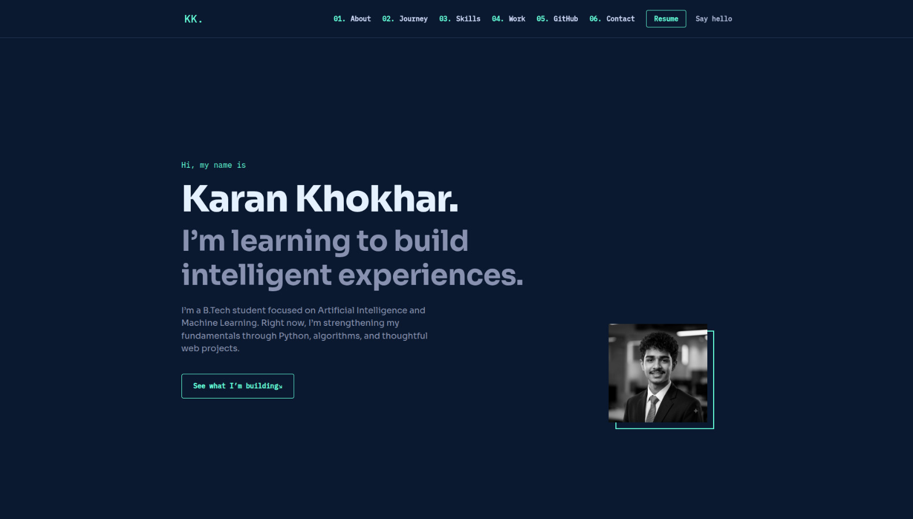
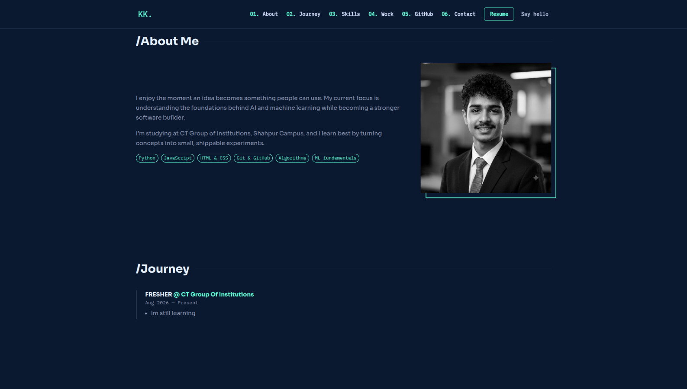
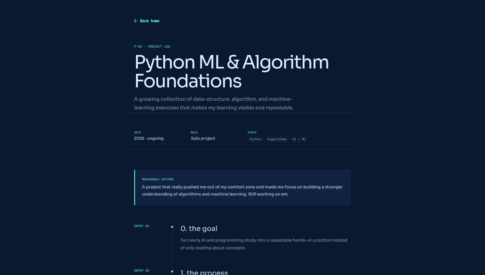

<div align="center">

# Karan Khokhar — Portfolio

### An AI/ML student portfolio built to document practical work, learning, and growth in public.

[](https://kran-arch.github.io/karan/)
[](https://react.dev/)
[](https://vitejs.dev/)
[](https://mui.com/)

[Explore the live site](https://kran-arch.github.io/karan/) · [Report an issue](https://github.com/kran-arch/karan/issues)

</div>

<br />

## Overview

This is my personal portfolio: a focused place for selected work, documented learning, and project case studies. It is designed to be simple to navigate, easy to maintain, and accessible across screen sizes.

The visual direction was influenced by [Gazi Jarin’s portfolio](https://www.gazijarin.com/), while the implementation, content structure, and project presentation are original.

## Preview

<div align="center">
  
</div>

<br />

<div align="center">
  
  
</div>

## What’s inside

| Area | Purpose |
| --- | --- |
| **Direct introduction** | Communicates my AI/ML focus and internship availability quickly. |
| **At-a-glance status** | Shares what I’m learning, seeking, and publishing next. |
| **Selected work** | Highlights projects with status, stack, outcome, and next step. |
| **Project case studies** | Shows the challenge, approach, result, build log, screenshots, and links. |
| **GitHub activity** | Fetches recent public repositories, with a local project fallback if the API is unavailable. |
| **Accessible experience** | Includes semantic headings, keyboard skip navigation, reduced-motion support, and responsive layouts. |
| **GitHub Pages ready** | Configured for static deployment at `/karan/`. |

## Tech stack

```text
React 19       UI and routing
Vite 6         Development server and production build
Material UI 6  Components and responsive styling
GitHub Pages   Static hosting
```

## Run locally

```bash
git clone https://github.com/kran-arch/karan.git
cd karan
npm install
npm run dev
```

Open the local URL Vite prints in your terminal.

## Available commands

| Command | Description |
| --- | --- |
| `npm run dev` | Start the local development server. |
| `npm run build` | Create an optimized production build in `dist/`. |
| `npm run preview` | Preview the production build locally. |

## Updating the portfolio

Most content is deliberately separated from layout code.

| File | Update here |
| --- | --- |
| [`src/data/content.js`](src/data/content.js) | Name, bio, status strip, social links, contact details, and site copy. |
| [`src/data/projects.js`](src/data/projects.js) | Project cards and their full case studies. |
| [`src/data/skills.js`](src/data/skills.js) | Skills and supporting context. |
| [`src/data/experience.js`](src/data/experience.js) | Education and experience timeline. |
| [`src/theme.js`](src/theme.js) | Color palette and typography tokens. |

The served portrait is [`public/profile.avif`](public/profile.avif). Its original source is retained outside the deployed public directory at [`src/assets/profile-original.jpg`](src/assets/profile-original.jpg).

## Deployment

The site is configured for GitHub Pages:

```js
// vite.config.js
base: "/karan/"
```

After building, deploy the `dist/` directory through your GitHub Pages workflow or hosting provider. If the repository name changes, update:

- `base` in [`vite.config.js`](vite.config.js)
- `siteUrl` in [`src/data/content.js`](src/data/content.js)
- GitHub Pages URLs in [`src/data/projects.js`](src/data/projects.js) and [`index.html`](index.html)

## Quality checks

```bash
npm run build
npm ci --dry-run --ignore-scripts
```

## License

This repository is intended as a personal portfolio. Please do not reuse its personal content, images, or résumé.

<div align="center">

Built by [Karan Khokhar](https://github.com/kran-arch) · Inspired by [Gazi Jarin](https://www.gazijarin.com/)

</div>
